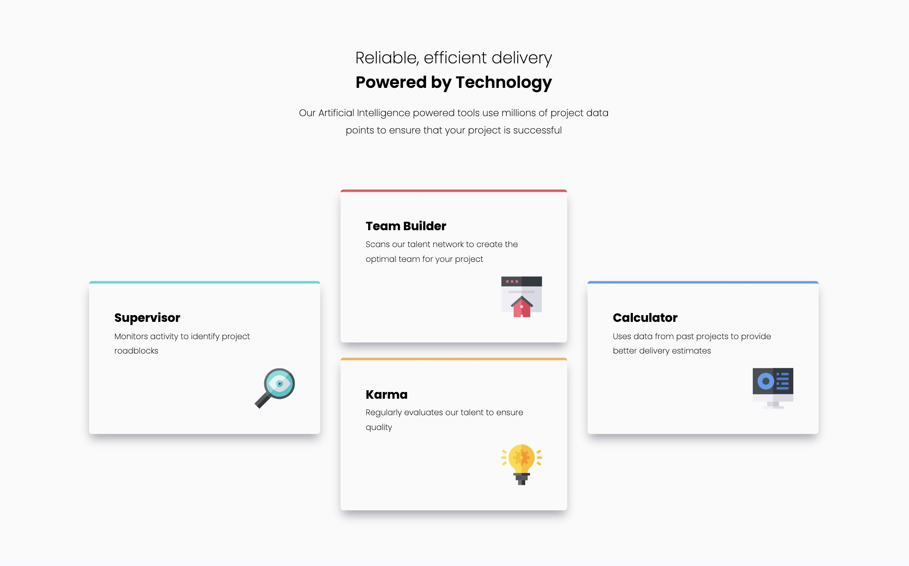

# Frontend Mentor - Four card feature section solution

This is a solution to the [Four card feature section challenge on Frontend Mentor](https://www.frontendmentor.io/challenges/four-card-feature-section-weK1eFYK). Frontend Mentor challenges help you improve your coding skills by building realistic projects.

## Table of contents

-   [Overview](#overview)
    -   [The challenge](#the-challenge)
    -   [Screenshot](#screenshot)
    -   [Links](#links)
-   [My process](#my-process)
    -   [Built with](#built-with)
    -   [What I learned](#what-i-learned)
    -   [Continued development](#continued-development)

## Overview

### The challenge

It was difficult to set the width and height of the cards based on the screen size and the content in each card.

### Screenshot




### Links

-   Solution URL: [Add solution URL here](https://your-solution-url.com)
-   Live Site URL: [Add live site URL here](https://your-live-site-url.com)

## My process

### Built with

-   Semantic HTML5 markup
-   CSS custom properties
-   Flexbox
-   Mobile-first workflow

### What I learned

When you set the width or max-width of an element, using calc() is helpful. It allows you to do math with the sizes based on how much space is available.

Also, by setting the width of each card to a percentage, the layout can adjust easily to different screen sizes.

To see how you can add code snippets, see below:

```css
    .card {
      ...
      max-width: calc(100% - 2 * 6rem);
    }
    .card-1,
    .card-2-3,
    .card-4 {
      ...
      width: 33%;
    }
```

### Continued development

I will keep learning how to set the width and height of elements so they are dynamic and flexible.
# four-card-feature-section-master
